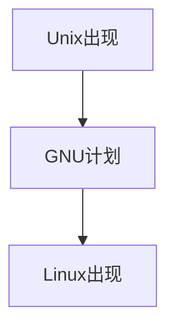
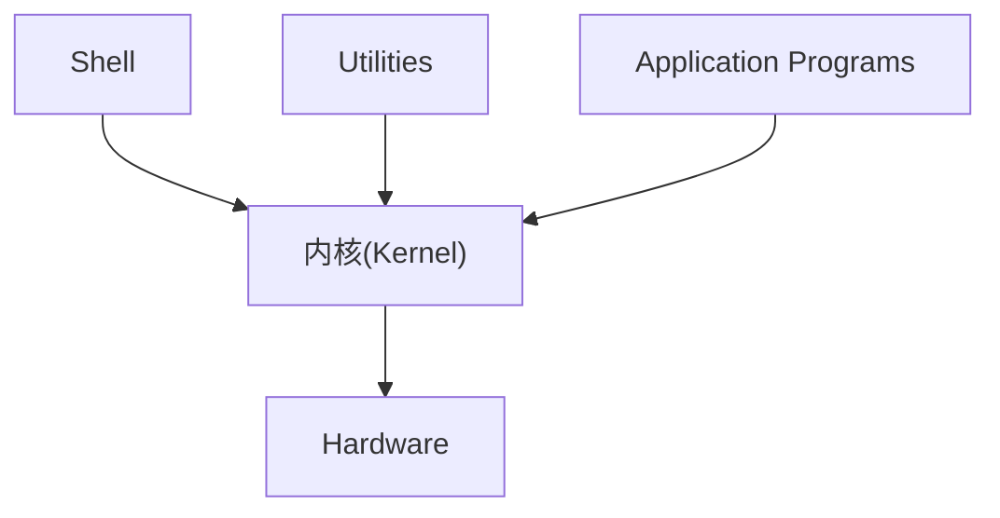
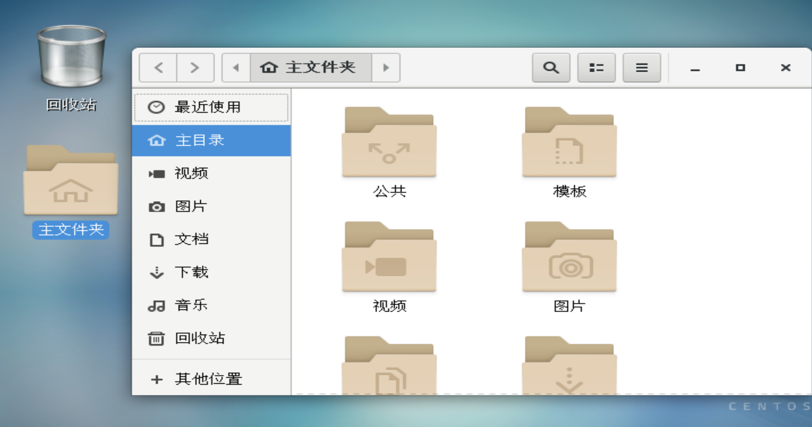
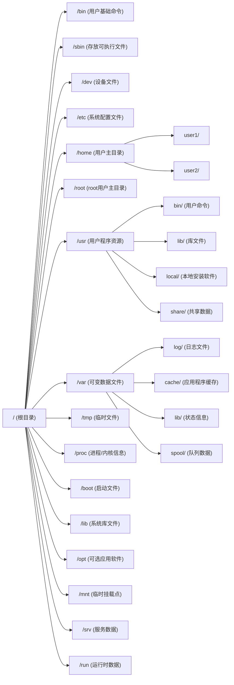
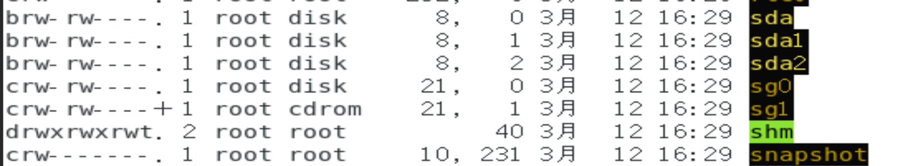
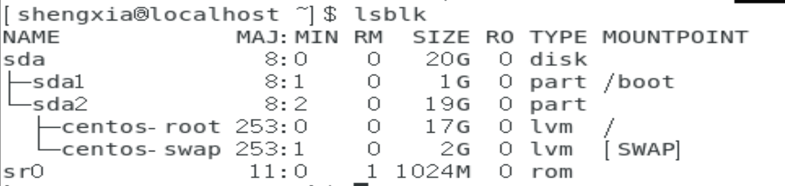
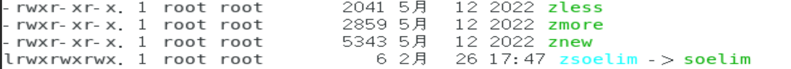
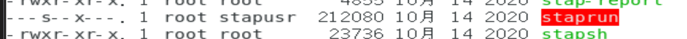

# Linux介绍

Linux是一种**多用户操作系统**，其可以为多个用户建立各自的账户，也允许拥有这些账户的用户同时登陆此计算机，每个账号可以同时运行多个程序。其中一个用户(root)具有管理这些用户资源的权限。

## 历史

* Unix在贝尔实验室由Ken Thompson实现。
* 1973年，他与Dennis Ritchie用C语言重写了Unix的第三版内核
* GNU计划开放源代码
* Linux内核项目由Linux Torvalds创建

### 常见的发行版本

* RedHat
* CentOS
* Debian
* Ubuntu

## 组成

内核(直接与硬件交互)+Shell(用户界面)+Linux实用程序与应用程序(一组处理日常需求的程序，通过Shell调用)

## 目录结构

对于Linux,*一切皆文件*

可以通过图形化界面查看目录结构

可以通过终端查看目录结构，见[1.2-Shell-查看目录](/1.2.md/Shell/查看目录)

### 根目录

Linux的文件结构是树型的，最顶层的`/`表示根目录。

### `/bin` `/sbin` 可执行文件

用于存放可执行文件

### `/boot`启动文件

目录内存放着系统启动程序

### `/dev` 设备文件

存放各类硬件设备(如`sda`为硬盘分区)

#### `lsblk` 查看硬盘信息

启动文件挂载在`/boot`中；其中2G分配在`[SWAP]`(虚拟内存)中

### `/home`用户主目录

### `/root`管理员主目录

### 区分目录和文件

* 前缀为`l`的为可执行文件
* 前缀为`-`的为目录

### 特殊高亮文件

特殊权限，针对用户

特殊权限，针对组
