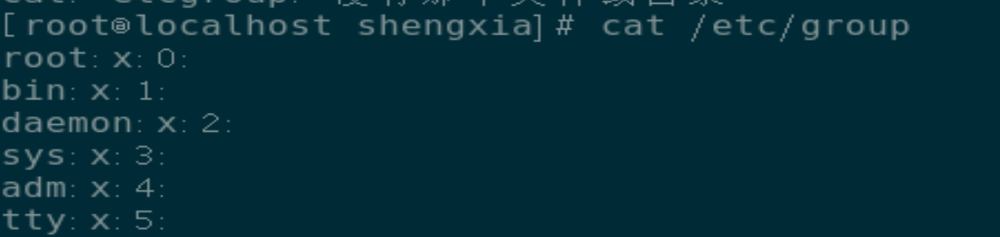

# 创建、管理和删除本地用户和组

## 描述用户和组

### 用户(User)

用户账户为不同人员和运行程序之间提供安全边界

用户使用 `Username`进行标识，操作系统为其分配唯一的标识号(UID),用户可能含有密码

系统中的每一个程序都以一个特定用户运行，每个文件都有一个特定用户作为所有者

用户账户有三种主要类型：超级管理员、系统用户、普通用户

`-superuser`就是root用户，UID=0，具有系统最高的权限

`-system user`就是用户系统管理，例如运行服务，不需要用于系统登录

`-regular user` 供用户进行日常系统管理，通常具有权限限制

可以使用 `id`命令查看当前登录的用户或者某个用户信息

`ls -l`命令查看所属用户

`ls -ld`命令查看目录所属用户

用户名：密码占位符：用户UID：主要组GID：用户的简短注释、描述的信息：用户的家目录：可以使用交互式登录

### 组

组是用户的集合，组中用户共享文件和其他系统资源的访问权限

组有 `group name`和 `GID`，匹配关系保存在 `\etc\group`中

组名：占位符：组ID：属于此组成员的用户列表，作为补充组（附加组）

主要组（私有组或者基本组） 和补充组（附加组）

每个用户只属于一个主要组（GID），对应GID在 `/etc/passwd`中，通过 `id 用户名`快速查询

创建普通用户时，会创建一个与用户同名的组，作为该用户的主要组，该用户是这个主要组的唯一成员

用户还可以有补充组（附加组），补充组中的成员资格存放在 /etc/group中，根据所在组是否具有访问权限，讲授予用户对文件的访问权限，不论这些组是主要组还是补充组

### 管理本地用户账户

UID范围

- UID 0 永远分配给 root
- UID 1-200 永远分配给 `system users`（红帽系统的服务）
- UID 201-999 分配给 `system users`，供文件系统中没有自己的文件的系统进程使用。
- UID 1000+ 分配给普通非特权用户

#### 用户的增删改查

##### 从命令行中创建用户

- 直接创建用户
  - `useradd 用户名`
- 指定新用户的UID
  - `useradd -u <UID> <Username>`
  - 此时新建用户UID会继承指定的UID往下
- 指定新用户的家目录
  - `mkdir /new_folder`
  - `useradd -d <path_to_folder> <username>`
  - 通过 `tail`指令查阅 `passwd`目录获取最后创建的家目录
- 添加用户，通过指定新用户为 `/sbin/nologin`使其不能登录
  - `useradd -s /sbin/nologin <username>`
- 新增用户，指定新用户的主要组
  - `useradd -g 已存在的组 组名`
- 新增用户，指定新用户的附加组
  -  `useradd -G 已存在的组 组名`
